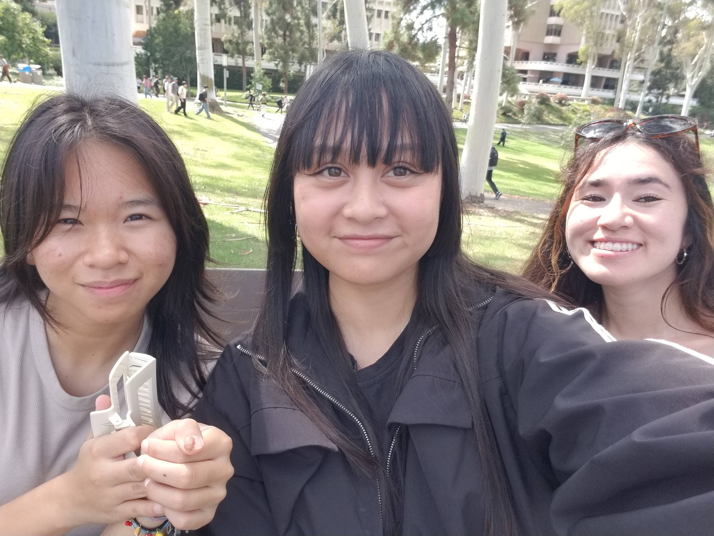
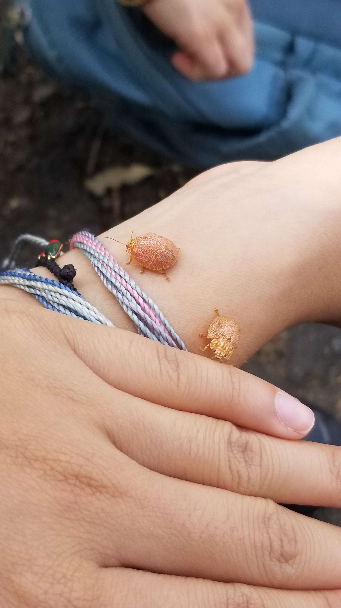

# Touch Grass Assignment

1. Introduction
Hi. Let me introduce myself. My name is Sophia Smith, and I am graduating this quarter. I also want to say I like this assignment because it helped me get out of my shyness and talk to new people which I cant wait to getting to know them more throughout this quarter. 

2. Topics
### Expectations and Concerns
Our expecations that we agreed upon was to gain or become better versed with hardware and operating systems. All of us talked about how we were looking forward to doing projects and hands-on learning. As a visual learner myself, its hard for me to grasp concepts when they are just explained to me. I learn better when either I draw them myself, or when the instructor draws it and lables, and also when I teach others and others teach me. In the park, while touching grass, we all agreed that we were visual learners. Additionally, the concern we have was low-level programming. We discussed that we had more familiarity with high-level programming. We were also concerned about how the assignments (big or small) would be formatted. Personally, my concern is taking exams. I have never been a good exam taker, and I am a bit nervous on what the exams would look like or what they would be. 

### Other Topics
We talked about our other courses we would be taking and what we looked forward to this quarter. We also talked about our goals in our personal lives. 

### What we found interesting in the park
During our talk, we found 2 cute little june bugs and got hyperfixated on them for 20 minutes!! We even took a picture with them

3. Our Picture(s)
Here we have our pictures and our bugs!! 

